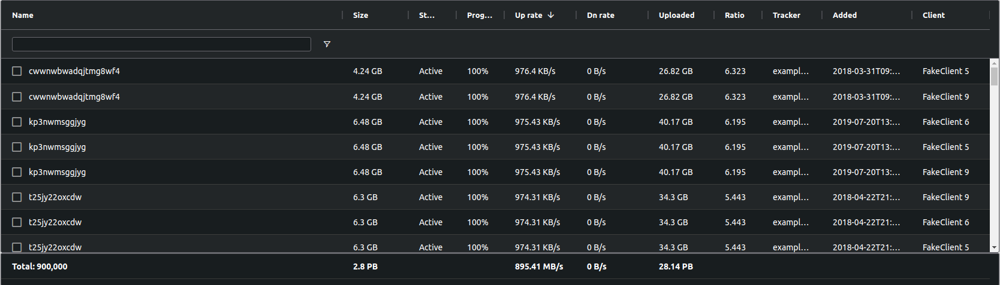

================================
Spreadsheet UI
================================

This is a web frontend that can combine multiple torrent clients into one.
Designed for the power-user who wants an overview and manage existing torrents.

The interface is based on ag-grid to provide stellar performance even with a large amount of torrents.
As a plus it will also look a bit like a spreadsheet.



Requirements
--------------------------------

* Python 3.7 or higher


Installation
--------------------------------

Linux
````````````````````````````````

.. code-block:: bash

    # Create a folder to put it all into
    mkdir spreadsheetui
    cd spreadsheetui

    # Create a python virtual environment and install spreadsheetui into it
    python3 -m venv env
    env/bin/pip install spreadsheetui

    # Download an example config file, remember to modify it
    curl -L -o config.toml https://github.com/JohnDoee/spreadsheetui/raw/master/config.toml.example

    # Start the UI
    env/bin/twistd spreadsheetui


Docker
````````````````````````````````

.. code-block:: bash

    # Create a folder to put it all into
    mkdir spreadsheetui
    cd spreadsheetui

    # Download an example config file, remember to modify it
    curl -L -o config.toml https://github.com/JohnDoee/spreadsheetui/raw/master/config.toml.example

    curl -L -o docker-compose.yml https://github.com/JohnDoee/spreadsheetui/raw/master/docker-compose.yml
    docker-compose up -d


Configuration
--------------------------------

Edit config.toml to fit your needs.

Remember to change username, password. The secret_key should also be changed, anything random will do.

You can add as many clients as you want, see the provided examples for syntax.

When you are done and have started Spreadsheet UI, it is accessible on port 18816

If you need to use a proxy layer to access your client (e.g. with Docker) `check out liltorrent <https://github.com/JohnDoee/libtc#liltorrent-usage>`_.

Moving torrents
--------------------------------

For torrent moving to work, the `session_path` must be correct, `see more about session_path here <https://github.com/JohnDoee/libtc#session-path--fetching-torrents>`_

Executing jobs
--------------------------------

Jobs in SpreadsheetUI works by using a jobqueue. This means jobs are not executed before you trigger them so you can
make sure all your scheduled jobs are as you want then to be.

How to run a job

* Select some torrents
* Right-click and select the action you want (e.g. stop)
* Right-click and click "Goto Jobqueue"
* Verify your scheduled jobs
* Right-click and click "Execute queued jobs"

Your jobs will now slowly be executed in order.

To go back to the dashboard: Right-click and click "Goto Dashboard"

The changes might be slow to show up in your torrent list.
If you want to force a full update, right-click and click "Run full update"

Features
--------------------------------

Clients:

* rtorrent
* Deluge
* Transmission
* qBittorrent

Methods:

* List all torrents
* Start / stop torrents
* Move torrents between clients

Logo / icon
--------------------------------

spreadsheet by Adrien Coquet from the Noun Project

License
---------------------------------

MIT